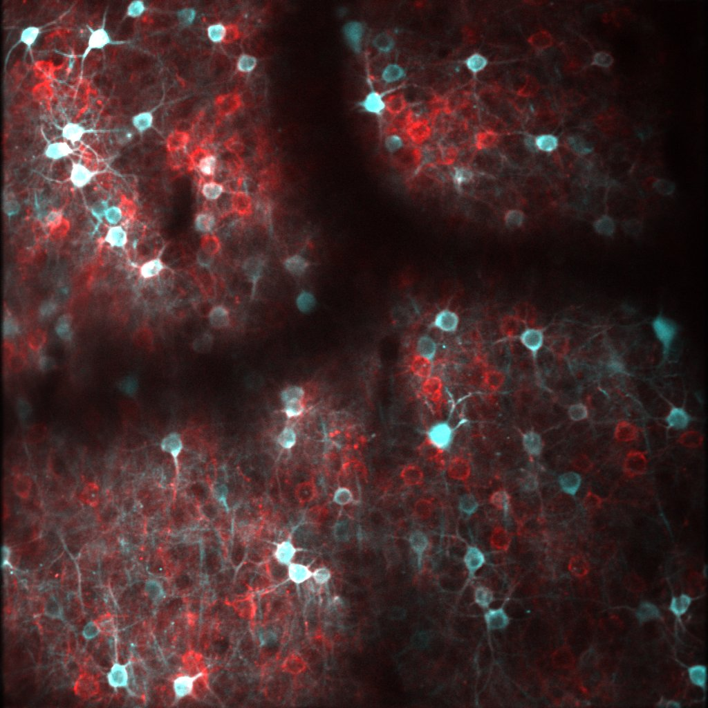
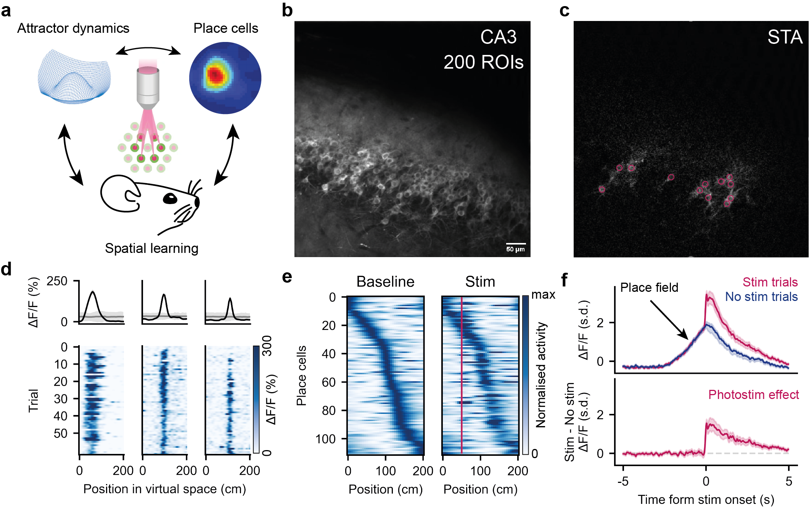

  
  

# Neuroscientist 

## Education
- Ph.D., Neuroscience | University College London (_July 2024_)								       		
- M.S.c.R., Neuroscience | University of Edinburgh (_July 2019_)	 			        		
- B.S.c. (Hons), Neuroscience | University of Edinburgh (_May 2018_)

  
  

## Tools
### All-optical interrogation

  
  &nbsp;&nbsp;&nbsp;
  

<small>
  <strong>Left:</strong> Two-photon image of opsin and indicator co-expression in cortex (acquired in Moser lab at NTNU). 
  <strong>Right:</strong> All-optical stimulation of hippocampal sequences (acquired in collaboration with Nick Robinson at UCL).
</small>

### High-yield extracellular electrophysiology (Neuropixels)

### Voltage imaging  

### Virtual reality 

### Open field recordings 

## Projects 

### Measuring long-range functional connectivity at cellular resolution in vivo 

<small>
  I develop novel approaches for studying long-range functional connections between brain areas during behaviour (work done at UCL). 
</small>

### Hippocampal dynamics underlying temporal association learning 

<small>
  We use all-optical interrogation to study how hippocampal sequences support the formation of memories across time (work done in collaboration with Moritz Buchholz, Daniel Dobolyi and Nick Robinson at UCL). 
</small>

### Developing computational tools to improve stimulation resolution 

<small>
  We develop a computational approach to enable fast stimulus optimisation for holographic control of neural activity in vivo (work done in collaboration with Marcus Triplett).  [Paper](https://www.biorxiv.org/content/10.1101/2025.07.31.667911v1)
</small>

### All-optical interrogation of recurrent memory networks 

  

<small>
  We use all-optical to study memory processing in hippocampal CA3 (work done in collaboration with Rokas Stonis at UCL). 
</small>

## Talks & Lectures
- Invited speaker - Kavli Institute for Systems Neuroscience speaker series, Trondheim 2024
- Session chair - Spring Hippocampal Research Conference, Verona 2023
- Invited speaker  - 8th FNIP Webinar by University of Padua, Virtual 2023 [Youtube](https://www.youtube.com/watch?v=FCxVaeMQ9bs&ab_channel=FNIP)
- Invited speaker - Minisymposium on Imaging Riken Institute, Tokyo 2023
- Speaker - Interacting with Neural circuits Cajal Course, Lisbon 2023

## Teaching 

- **Teaching assistant**  _Interacting with Neural Circuits CAJAL course_ - Lisbon 2022 and 2023
  - Neuropixels module 2022
  - All-optical module 2023
- **Postgraduate teaching** - UCL 2021 and 2024
  - Undergraduate courses (workshops and tutorials)
  - Wellcome Trust Optical Biology PhD Program (workshop)

## Publications 
1. Triplett A., **Bäumler E.**, Prodan A., Stonis R., Paterka D., Häusser M. & Paninski L. “Fast photostimulus optimization for holographic control of neural ensemble activity in vivo” – bioRxiv 2025. DOI: https://doi.org/10.1101/2025.07.31.667911
2. **Bäumler E.** “All-optical approaches for investigating downstream readout of hippocampal activity patterns” – PhD Thesis UCL 2024 https://discovery.ucl.ac.uk/id/eprint/10195198/
3. Tsutsumi T., Chadney O., Long Yiu T., **Bäumler E.**, Faraggiana L., Beau M. & Häusser M. “Purkinje cell activity determines the timing of sensory-evoked motor initiation” – Cell Reports 2020 DOI: https://doi.org/10.1016/j.celrep.2020.108537
4. **Bäumler E.**, Strickland L. & Privitera L. “Molecular underpinnings of estradiol-mediated sexual dimorphism of synaptic plasticity in the hippocampus of rodents (Journal club)” – Journal of Neuroscience 2019 DOI: https://doi.org/10.1523/JNEUROSCI.2894-18.2019
